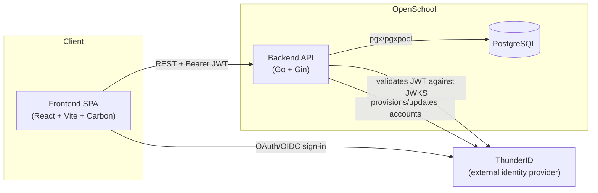
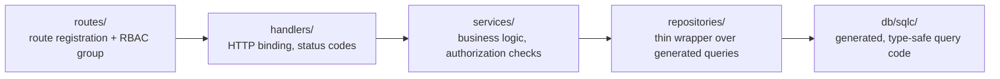

This document describes how OpenSchool is put together: components,
layering, data model, external interfaces, and the non-functional
properties the system is designed around. For *what* the system does, see
the [Features](/features) page; for *why* specific non-obvious decisions
were made the way they were, see the
[Architecture Decision Records](./adr).

## 1. System overview

OpenSchool is a two-process web application plus one required external
service:

There is no server-rendered HTML, no background job queue/worker process,
and no cache layer (e.g. Redis) in front of the database today — every
read goes straight to Postgres. See
[ADR 0005 — Hand-rolled password lifecycle](./adr/0005-hand-rolled-password-reset)
for the one place OpenSchool stores anything resembling a credential
itself, and [§6, "Security"](#6-non-functional-characteristics) below for
what that implies operationally.

## 2. Backend architecture

Go, using the [Gin](https://gin-gonic.com/) HTTP framework and
[pgx](https://github.com/jackc/pgx)/[sqlc](https://sqlc.dev/) for
database access. Every feature module follows the same four-layer
structure:

- **`internal/routes/`** — registers each module's endpoints onto one of
  five pre-built Gin route groups (`admin`, `teacherOrAdmin`, `teacher`,
  `student`, `parent`), each already gated by `middleware.RequireRole`.
  A handful of modules (`timetable/`, `notifications/`) are large enough
  to get their own subpackage, following the same pattern.
- **`internal/handlers/`** — parses/validates the HTTP request, calls into
  the matching service, and maps the result (or error) to a status code
  and JSON body. Carries the `swaggo` annotations that generate
  `backend/docs/swagger.json`.
- **`internal/services/`** — where authorization checks beyond plain role
  (e.g. "is this teacher assigned to this class") and business rules
  live. This is the layer most worth reading first when investigating a
  bug — see the project's `audit.md` for where that pattern has and
  hasn't been applied consistently.
- **`internal/repositories/`** — one thin method per `sqlc`-generated
  query function; exists mainly so services depend on an interface rather
  than the generated package directly.
- **`internal/models/`** — request/response DTOs (distinct from
  `db/sqlc/models.go`'s generated row structs).

Cross-cutting packages:

- **`internal/middleware/`** — `AuthMiddleware` (JWT validation against
  ThunderID's JWKS), `RequireRole`, `RateLimit` (per-IP token bucket),
  `SecurityHeaders`.
- **`internal/identity/`** — the provider-neutral seam
  (`Provider` interface: `CreateUser`/`UpdateUser`/`DeleteUser`/`AssignRole`)
  that `internal/thunderid` implements. See
  [ADR 0001 — ThunderID as the sole identity provider](./adr/0001-thunderid-as-sole-identity-provider).
- **`internal/database/`** — DSN construction, pool setup, and the
  `golang-migrate` runner invoked automatically on startup.
- **`internal/config/`** — `.env` loading via `godotenv`.

**Database access rule:** all SQL lives in `backend/db/queries/*.sql`,
annotated for `sqlc`; running `sqlc generate` regenerates
`backend/db/sqlc/`, which is never hand-edited. Schema is defined
entirely by the versioned migrations in `backend/db/migrations/`
(currently 32), applied automatically on every backend startup.

## 3. Frontend architecture

Vite + TypeScript + React 19, using IBM's
[Carbon Design System](https://carbondesignsystem.com/) for components and
[TanStack Query](https://tanstack.com/query) for server-state management.

- **`main.tsx`** — composition root: `ThunderIDProvider` →
  `QueryClientProvider` → `BrowserRouter` → `App`.
- **`App.tsx`** — resolves the signed-in user's role from their JWT
  (`useRole`) and renders one of four route trees (Admin/Teacher/Student/
  Parent), each behind its own layout component and `ProtectedRoute`.
  There is no separate URL namespace per role for the admin portal;
  teacher/student/parent portals use short URL prefixes (`/t/...`,
  `/p/...`) mainly to disambiguate routes that exist in more than one
  portal.
- **`src/pages/`** — one directory per portal (`admin/`, `teacher/`,
  `student/`, `parent/`, `notifications/` shared across portals); admin
  pages are further split by module, mirroring the backend's module list.
- **`src/services/`** — one file per backend module, wrapping `axios`
  calls with typed request/response shapes matching the backend's
  `internal/models/`.
- **`src/queries/`** — TanStack Query hooks built on `src/services/`;
  every query key is a named, typed builder function (e.g.
  `studentKey(id)`), and mutations invalidate the specific keys they
  affect. This layer is the most consistently well-executed part of the
  frontend.
- **`src/hooks/`** — cross-cutting hooks (`useRole`, `useApi` — the axios
  interceptor wiring the ThunderID access token onto every request,
  `useProvisionUser`, `usePagination`).
- **`src/components/common/`** — the shared CRUD-page building blocks
  (`ConfirmDeleteModal`, `EntityCombobox`, `EmptyState`, `TableSkeleton`,
  etc.) that essentially every admin page composes from, giving the ~40
  admin pages a consistent list → modal-form → confirm-delete shape.

**Convention:** almost every admin CRUD page follows the same template —
list with search/filter, a `ComposedModal` for create/edit, a shared
`ConfirmDeleteModal` for delete, and the same three loading/empty/error
states. Deviating from this template without a reason is a signal
something's off, not a style choice.

## 4. Data model

Schema is defined across 32 versioned migrations
(`backend/db/migrations/`). Grouped by area:

| Area | Tables |
| --- | --- |
| Identity & accounts | `users`, `password_reset_tokens` |
| School & academic structure | `school`, `academic_years`, `houses`, `grades`, `classes`, `streams`, `stream_groups`, `mediums` |
| Curriculum | `subjects`, `levels`, `selection_groups`, `subject_buckets`, `subject_bucket_options`, `group_subjects`, `grade_subjects` |
| People | `student_profiles`, `student_siblings`, `student_guardians`, `guardians`, `teacher_profiles`, `teacher_subjects`, `non_academic_staff`, `prefects`, `section_heads`, `teacher_positions`, `vice_principal_grade_scopes` |
| Enrollment | `class_students`, `class_subject_teachers`, `student_subject_enrollments`, `student_subject_selections`, `student_enrollment_locks` |
| Attendance | `attendance_sessions`, `attendance_records`, `staff_attendance_records` |
| Academic records | `terms`, `term_marks`, `student_progress_reports`, `student_activities`, `student_leadership_roles`, `student_awards`, `student_disciplinary_records` |
| Timetable | `timetable_settings`, `grade_sections`, `grade_section_grades`, `classrooms`, `subject_period_requirements`, `teacher_availability`, `timetables`, `timetable_periods`, `timetable_entries`, `timetable_status_history`, `timetable_notifications` |
| Notifications | `notifications`, `notification_recipients` |
| Audit | `audit_logs` |

### Key relationships

- **`users`** anchors every login-capable account, 1:1 with
  `teacher_profiles` / `student_profiles` / a login-enabled `guardians`
  row.
- **`academic_years`** is the temporal scope almost everything else reads
  through its `is_current` flag — see
  [ADR 0003 — Single current academic year](./adr/0003-single-current-academic-year).
- **`classes`** belongs to a `grade` + `academic_year`, optionally a
  `stream`/`stream_group` (Advanced Level) and a `medium`; `class_students`
  is the per-year many-to-many enrollment junction;
  `class_subject_teachers` is the per-class, per-subject teacher
  assignment.
- **`student_guardians`** is the many-to-many junction supporting shared
  guardians across siblings.
- **`teacher_positions`** + `vice_principal_grade_scopes` implement the
  Principal/Vice Principal layer; see
  [ADR 0002 — In-app position layer](./adr/0002-in-app-position-layer).
- **`timetables`** owns `timetable_entries` (per-period assignments) and
  `timetable_status_history` (the transition audit trail);
  `timetable_periods` belongs to a `grade_section`, not an individual
  timetable, since a period grid is shared by every class in that
  section.
- **`audit_logs`** is a generic, entity-agnostic append-only log
  (`entity_type` + `entity_id` + `action` + before/after JSON), not a
  per-table audit trail.

For exact columns, types, and constraints, `backend/db/sqlc/models.go`
(generated from the migrations, in the source repository) is the
authoritative reference — this table is a navigational summary, not a
schema dump.

## 5. External interfaces

### 5.1 ThunderID (identity provider)

Two integration points, both configured via `THUNDERID_*` environment
variables (see [ThunderID Setup](./thunderid)):

1. **Token validation** — every authenticated request's JWT is validated
   against ThunderID's JWKS endpoint (RS256, issuer-checked) in
   `internal/middleware/auth.go`.
2. **Provisioning API** — account create/update/delete and role
   assignment, via `internal/thunderid.Client`, behind the
   `internal/identity.Provider` interface.

OpenSchool never stores a primary login password; see
[ADR 0001 — ThunderID as the sole identity provider](./adr/0001-thunderid-as-sole-identity-provider).

### 5.2 REST API

JSON over HTTP under `/api/v1`, documented via OpenAPI/Swagger
annotations and served at `/swagger/index.html` — **development builds
only** (`APP_ENV=development`), not exposed in production. Authenticated
via `Authorization: Bearer <JWT>` on every route except `/health`, the
one-time `/setup/admin`, and the unauthenticated password-reset
identify/reset endpoints. This API is what the bundled frontend talks to
— it isn't offered as a public, third-party-facing product.

## 6. Non-functional characteristics

### Security

- All primary-flow authentication/password storage is delegated to
  ThunderID.
- Self-service password-reset tokens (the one credential-like thing
  OpenSchool stores itself) are hashed (SHA-256), single-use, and expire
  in 15 minutes — see [ADR 0005](./adr/0005-hand-rolled-password-reset)
  for why this exists and its known weakness.
- `X-Content-Type-Options: nosniff`, `X-Frame-Options: DENY`, and
  `Referrer-Policy: same-origin` are set on every response; no CSP, since
  this is a JSON-only API that never serves HTML.
- CORS origins are an explicit allow-list, not a wildcard.
- The server does not trust `X-Forwarded-For` from arbitrary clients (no
  proxies trusted by default), so per-IP rate limiting can't be trivially
  spoofed by a client-supplied header.
- Every request is rate-limited per client IP (default 30 req/s, burst
  60), independent of any endpoint-specific stricter limit (e.g. the
  admin-registration and password-reset endpoints).

See the project's `audit.md` (in the source repository) for known gaps
against the above as of its last update, and the
[Security Policy](https://github.com/openschool-org/openschool/blob/main/SECURITY.md)
for how to report a new one.

### Availability & reliability

- Migrations run automatically and idempotently on backend startup; the
  process fails fast (refuses to start serving traffic) if migrations
  fail.
- HTTP read/write timeouts (15s) and idle timeout (60s) bound resource
  usage per connection.

### Performance

- Rate-limit defaults are deliberately generous: school users are
  frequently behind one shared IP/NAT, so a tight per-IP limit would
  throttle an entire school rather than an individual abusive client.
  Tunable via environment variables without a code change.
- Bulk operations that touch many rows at once (e.g. promotion commit)
  use batched, set-based SQL writes rather than per-row loops where this
  pattern has been applied — not yet applied uniformly everywhere a
  per-row loop exists today.
- No load testing has been performed against a realistic full-school
  concurrent-usage pattern (e.g. a morning attendance-marking rush); rate
  limit and DB pool defaults are provisional pending that.

### Maintainability

- Consistent layered architecture (routes → handlers → services →
  repositories) across all ~30 backend feature modules.
- Generated code (`db/sqlc/`, Swagger docs) is never hand-edited — always
  regenerated from its source of truth.
- One consistent CRUD-page template across the frontend admin portal's
  ~40 pages.

## 7. Constraints and assumptions

- **Single school, single current academic year per deployment** — see
  [ADR 0003](./adr/0003-single-current-academic-year). Not multi-tenant;
  each deployment is one school's own instance.
- **A running ThunderID instance is a hard dependency** — there is no
  degraded/offline authentication mode.
- **In-app notifications only** — no email/SMS/push delivery channel; see
  [ADR 0004 — In-app-only notifications](./adr/0004-in-app-only-notifications).
- **NIC numbers** are validated loosely (required, non-empty) rather than
  by strict format, since valid Sri Lankan NICs come in both a 9-digit+
  letter and a 12-digit-numeric form.
- **No reverse proxy is assumed in front of the backend by default** —
  deploying behind one requires reconfiguring `SetTrustedProxies`.

## 8. Actors

| Actor | System access |
| --- | --- |
| **Administrator** | Full system access — the only role that can configure school structure, run promotion, publish timetables, and view the audit log/analytics |
| **Principal / Vice Principal** | `teacher`-role account with an elevated in-app position — broad or whole-school notification reach |
| **Section Head / Class Teacher / Subject Teacher** | `teacher`-role account with a narrower in-app position — attendance, timetable build/review, and notifications scoped to their assignment |
| **Teacher (no position)** | Attendance marking, own classes/timetable, scoped notifications |
| **Student** | View-only: own profile, attendance, marks, timetable |
| **Parent/Guardian** | View-only: linked children's attendance, marks, timetable |

Server-side authorization is authoritative for every actor above — see
`internal/middleware.RequireRole` and each service's own assignment
checks; frontend restrictions are a convenience layer, not a security
boundary.
